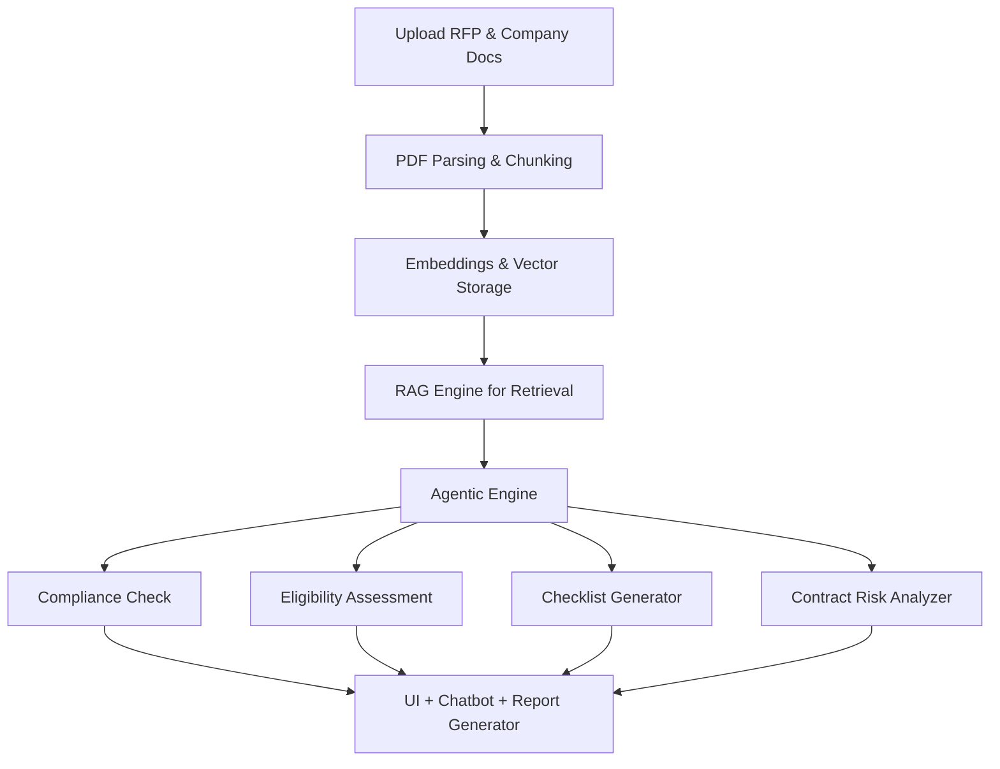

# 🚀 **RFP-AI Analyzer**

Automating Government RFP Analysis using Generative AI, RAG & Agentic Workflows

## **Problem Statement**

The current RFP review process is manual, time-consuming, and high-risk.
- ⌛ Takes hours to days to review a single RFP
- ❌ Prone to missing deal-breaker clauses
- ⚖️ Difficult to identify biased terms or eligibility gaps
- 🔁 Repetitive for every new RFP
- 🤯 No central intelligence or analytics

---

## 🎯 **Goal**

An AI-powered RFP analysis tool that automates document review using:
- 🧠 Generative AI
- 📚 RAG (Retrieval-Augmented Generation)
- 🤖 Agentic Workflows

| Challenge | Automation |
|----------|------|
| Manual Review | 🔁 Automated AI-Powered Analysis |
| High Error Rate | ✅ Accurate, Rule-Based Compliance |
| Missed Clauses | ⚠️ Risk Detection & Flagging |
| Long Review Time | 🚀 Instant Verdicts in Minutes |

---

## 🌟 **Innovation Highlights**

| | Innovation | Description |
|--|-------------|-------------|
| 🔄 | **Agentic Workflows** | A modular system of AI agents—each focused on Compliance, Eligibility, Risk, and Checklist generation. Data flows downstream for deeper contextual understanding. |
| 🧠 | **RAG-Driven Legal Intelligence** | Combines semantic search and LLMs to retrieve exact clauses, match company data, and explain results. |
| 🧪 | **Compliance Simulator** | Toggle hypothetical certifications and simulate eligibility dynamically. |
| 🤝 | **Multi-user Collaboration Ready** | Designed to support legal and sales team reviews in parallel.

---

## 🧱 **Architecture Overview**

## 🧱 **Tech Stack**

| Layer         | Tools / Frameworks                    |
|---------------|----------------------------------------|
| **Frontend**  | React.js, TailwindCSS, ShadCN          |
| **Backend**   | FastAPI                                |
| **LLMs**      | OpenAI GPT-4 / Gemini Pro              |
| **RAG Engine**| LangChain / LlamaIndex                 |
| **Vector DB** | FAISS / Chroma                         |
| **Agents**    | CrewAI / LangGraph                     |           |
| **Hosting**   | Vercel |

---

## 🔍 **Features**

- **Automated RFP Analysis**  
  Upload government RFP PDFs and get a structured breakdown including eligibility, requirements, and evaluation metrics.

- **RAG-Based Contextual Understanding**  
  Uses Retrieval-Augmented Generation to fetch context from the RFP and provide accurate, grounded responses.

- **Agentic Workflow with Role-Based Execution**  
  Simulates different expert agents (Legal, Technical, Financial) to collaboratively review and summarize RFP sections.

- **Gap & Risk Analysis**  
  Detects missing compliance requirements or potential disqualifiers based on your business profile.

- **Summarized Outputs**  
  Generates executive summaries, proposal highlights, and requirement tables for quick decision-making.

- **Export & Collaboration**  
  Download results in Excel or PDF and share internally with your team for proposal drafting.

---

## 💼 **Business Value**

- **Time Savings**  
  Reduces RFP review time from **hours to minutes**, allowing more tenders to be considered simultaneously.

- **Better Decision-Making**  
  Helps teams identify *winnable* RFPs faster by highlighting feasibility and risks upfront.

- **Improved Proposal Quality**  
  Ensures proposals are **100% compliant** with all terms and conditions, increasing win rates.

- **Democratized Access**  
  Enables smaller businesses to compete by leveling the playing field with automated legal and technical review.

- **Team Efficiency**  
  Minimizes dependence on large legal or proposal teams — agents handle the heavy lifting.

---

## 🚀 **Future Scope**

- **Proposal Draft Generation**  
  Auto-generate proposal drafts tailored to the RFP’s structure and evaluation criteria.

- **Integrate with Govt Portals**  
  Pull RFPs directly from platforms like GeM, CPPP, and state eProcurement systems.

- **Live Collaboration**  
  Enable multiple team members to annotate and review RFPs in real time.

- **Multi-Language Support**  
  Analyze RFPs written in regional Indian languages or other global languages.

- **Custom Agent Training**  
  Let users fine-tune their own agent behaviors (e.g., specific compliance checks or pricing models).

- **Competitor Benchmarking**  
  Suggest strategies based on analysis of previous winners or similar tenders.

---

